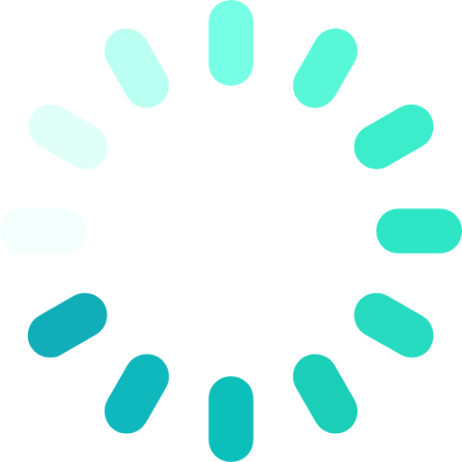

<!-- 1枚目：タイトル -->
# 時間割アプリ（科目検索機能付き）

### ハッカソン成果発表  
#### チーム名：金曜日班

---

<!-- 2枚目：概要 -->
## 概要

<div style="display: flex; align-items: center;">
  
  <div>
    <ul>
      <li>学生の「時間割管理が面倒！」を解決</li>
      <li>科目検索で簡単に時間割作成</li>
      <li>Webでどこでも編集・確認</li>
    </ul>
  </div>
</div>

---

<!-- 3枚目：特徴 -->
## 特徴

<div style="display: flex; flex-wrap: wrap; gap: 32px;">
  <div style="flex: 1; text-align: center;">
    <br>
    美しいUI
  </div>
  <div style="flex: 1; text-align: center;">
    <br>
    科目検索
  </div>
  <div style="flex: 1; text-align: center;">
    <br>
    スマホ対応
  </div>
  <div style="flex: 1; text-align: center;">
    <br>
    リアルタイム反映
  </div>
</div>

<br>


---

<!-- 4枚目：使用技術 -->
## 使用技術

<div style="display: flex; align-items: center; gap: 32px;">
  
  
  
  
  
  
  
</div>

---

### システム構成図

```mermaid
graph TD
  A[ブラウザ\nHTML/CSS/JS] -->|API通信| B[Flask(Python)]
  B -->|CSV読込・検索| C[CSVデータ\npandas]
  B -->|保存| D[SQLite]
```

---

<!-- 5枚目：ファイル構成 -->
## ファイル構成

```
wheel-up-2025-fri3-hackathon/
├── app.py
├── search/
│   ├── search.py
│   └── with_class_method.csv
├── static/
│   ├── css/
│   └── js/
├── templates/
└── ...
```

- **app.py**: サーバー・API
- **search.py**: 科目検索ロジック
- **with_class_method.csv**: 科目データ
- **static/**: CSS・JS
- **templates/**: HTML

--- 